# 🍓 SASA Tarım & İşletme ERP Sistemi

<p align="center">
  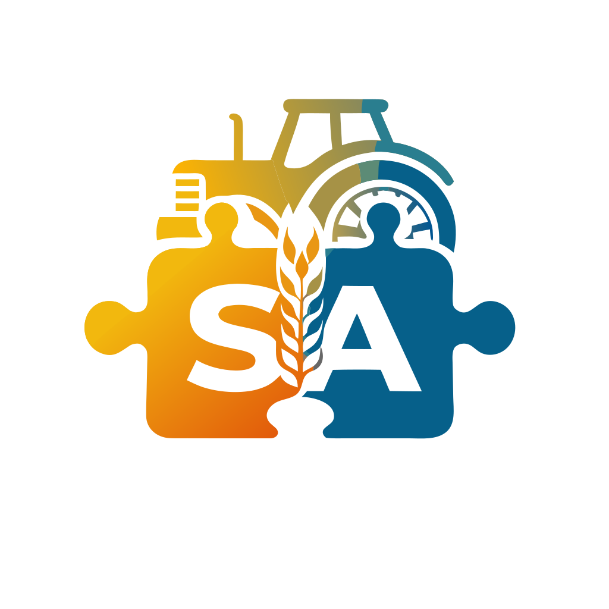
</p>

<p align="center">
  <strong>Endüstriyel Tarım, Modern Sera Otomasyonu, Hasat Puantajı ve DİA Entegrasyonlu Kurumsal Kaynak Planlama (ERP) Platformu</strong>
</p>

<p align="center">
  
  
  
  
  
  
  
  
</p>

---

## 📌 Proje Genel Bakış ve Mimarisi

**SASA Tarım ERP**, modern sera ve açık tarla tesislerinin üretimden hasada, işçilik puantajından gübre/ilaç reçetelerine, su arıtma otomasyonundan sipariş ve irsaliyeli sevkiyata kadar tüm operasyonel süreçlerini tek bir merkezden yönetmek için geliştirilmiş kapsamlı ve yüksek performanslı bir kurumsal yönetim platformudur.

Sistem; **Laravel 11**, **Vue 3 (Composition API)**, **Inertia.js** ve **Tailwind CSS** modern web mimarisi üzerinde inşa edilmiş olup tam duyarlı (responsive) tasarım, koyu/açık mod desteği ve DİA ERP entegrasyonu sunar.

---

## 🚀 Detaylı Modül Özellikleri ve Sistem Ekran Görüntüleri

### 1. 📊 Yönetici Kokpiti (Dashboard) & Finansal Analitik
İşletme yöneticilerinin üretim sahaları, hasat çıktıları, operasyonel işçilik masrafları, kâr/zarar oranları ve meteorolojik risk verilerini (don riski, evaporasyon, rüzgar vb.) anlık olarak izleyebildiği merkezi kontrol paneli.

- **Dönemsel Filtreleme:** Bugün, Son 7 Gün, Son 30 Gün ve Tüm Zamanlar analitiği.
- **Finansal Özet:** Toplam Satış Geliri, Toplam Operasyon Masrafı, Net Kâr/Zarar ve Kâr Marjı (%) göstergeleri.
- **Trend Grafikleri:** Günlük hasat gelir ve gider eğrileri.
- **Meteoroloji & Don Uyarıları:** Canlı sıcaklık, nem, rüzgar hızı ve hasat öncesi bekleme (PHI) güvenlik alarmları.

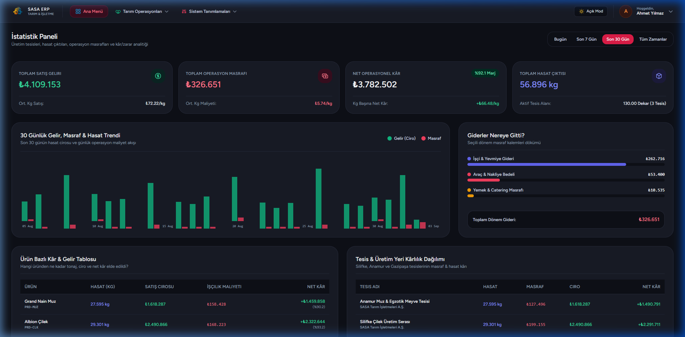

---

### 2. 📋 Yapılacaklar Listesi & Saha İş Planlama
İşletme müdürlerinin sahadaki teknik personele görev ataması yapabildiği, görev durumlarının ve süreç fotoğraflarının takip edildiği iş planlama modülü.

- **Görev Atama:** Tesis, iş türü, sorumlu personel ve hedef tarih bazlı planlama.
- **Fotoğraf ve Yorum Akışı:** Sahadaki personellerin tamamlanan işleri fotoğrafla kanıtlayabilmesi ve süreç notu ekleyebilmesi.
- **Durum Yönetimi:** Beklemede, Devam Ediyor, Tamamlandı ve İptal Edildi rozetleri.

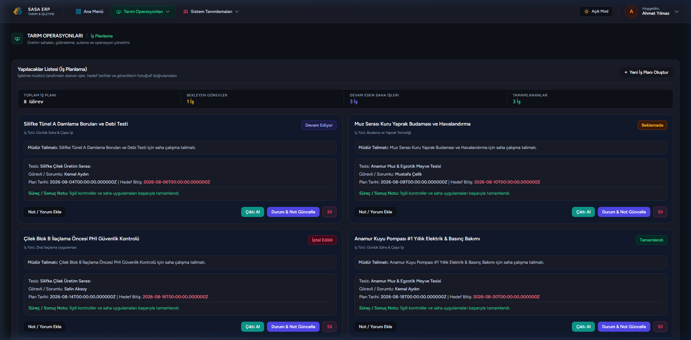

---

### 3. 🧪 Gübreleme Programı & Tank Takibi
Seralarda uygulanan kimyasal gübre reçetelerinin, hedef pH/EC değerlerinin ve çalışanlar için tank hazırlama föylerinin yönetimi.

- **Sözel Bitiş Şartı:** Spesifik bitiş tarihi yerine bitkinin fizyolojik evresine (*Örn: Çiçeklenme başlayana kadar*) göre programlama.
- **Tank Dökümleri:** A ve B tanklarına konulacak gübre gramajlarının otomatik hesaplanması ve A4 yazdırılabilir çıktısı.

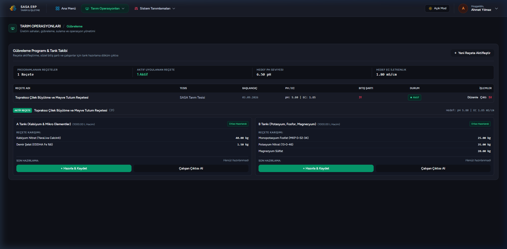

---

### 4. 💧 Sulama Programı & Vana Otomasyonu
Üretim sahalarındaki damlama/yağmurlama vanalarının saat ve süre bazında sulama takvimi.

- **Vana Bazında Takip:** Tesis altındaki her bir tünel/parsel vanasının başlangıç-bitiş saatleri ve metreküp (m³) tüketimi.
- **Gübreli Sulama Göstergesi:** Sulamanın gübreli mi yoksa sade su ile mi yapıldığının kaydı.

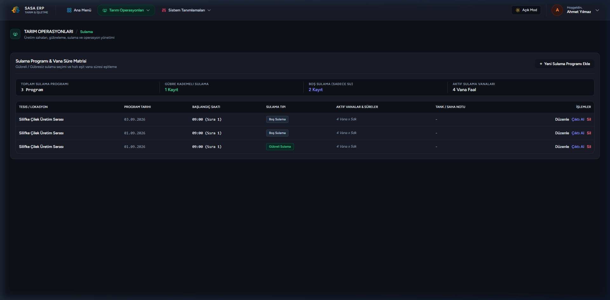

---

### 5. 🌿 İlaçlama ve Hasat Öncesi Bekleme (PHI) Güvenliği
Zirai mücadele ilaçlamalarının dozaj, hedef zararlı ve hasat güvenlik süreleriyle kayıt altına alınması.

- **PHI (Pre-Harvest Interval) Güvenlik Alarmı:** İlaçlanan parselin son hasat edilebileceği tarihi otomatik hesaplayarak erken hasat yapılmasını engeller.
- **Reçete Entegrasyonu:** Kayıtlı zirai ilaç reçetelerinden otomatik dozaj çekme.

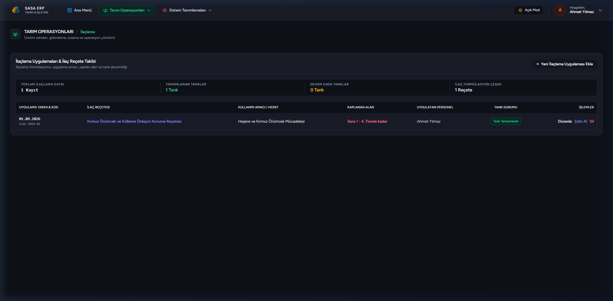

---

### 6. 🔬 Kaynak Suyu & Ters Osmoz (RO) Arıtma Kontrolü
Kuyu suyu kaynaklarının fizikokimyasal değerleri ile ters osmoz arıtma tesisinin basınç farkı takibi.

- **Giriş/Çıkış Basınç Analizi:** Giriş ve çıkış bar basınçları arasındaki fark kritik eşiği aştığında otomatik "Filtre Yıkama / Membran Değişimi" uyarısı.
- **Klor ve Pompa Durumu:** Dozaj pompaları, klor tankı seviyeleri ve pH/EC ölçüm logları.

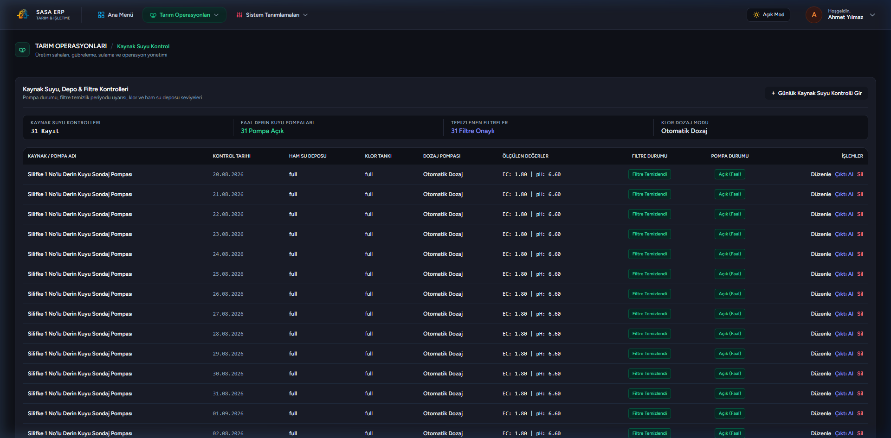

---

### 7. 📦 Alınan Müşteri Siparişleri Yönetimi
Toptancı, süpermarket zincirleri ve ihracatçı müşterilerden gelen mahsul siparişlerinin kabulü ve takibi.

- **Çoklu Kalem Desteği:** Tek siparişte birden fazla ürün, alt kalite sınıfı ve kasa/ambalaj seçimi.
- **Otomatik Bakiye Hesaplama:** Toplam sipariş miktarı, sevk edilen miktar ve kalan bakiye kg hesaplaması.
- **DİA Cari Entegrasyonu:** Müşteri carilerinin DİA ERP üzerinden otomatik çekilmesi.

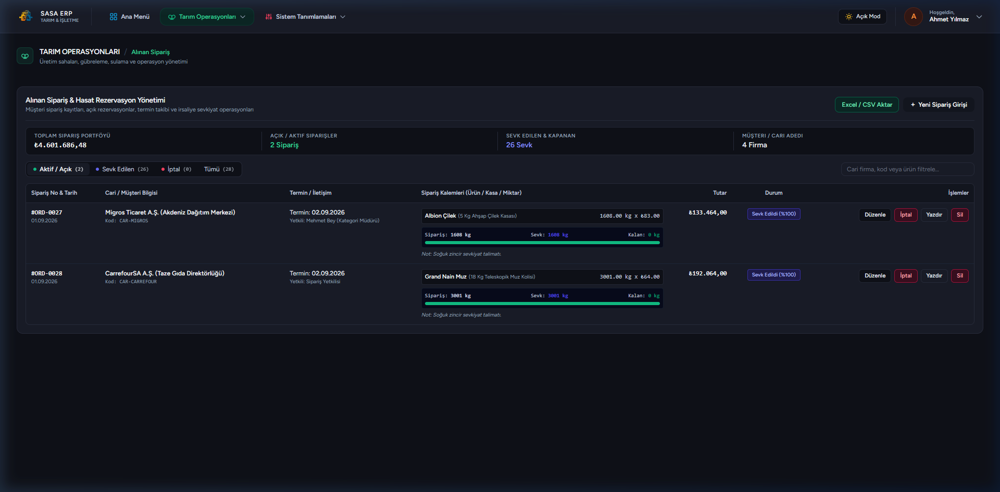

---

### 8. 🚚 İrsaliyeli Sevkiyat & Teslimat Yönetimi
Hazırlanan ürünlerin araç ve şoför bazında tartılarak irsaliye ile müşteriye sevk edilmesi.

- **Kısmi Sevkiyat:** Bir siparişin parça parça farklı günlerde ve araçlarda sevk edilebilmesi.
- **Resmi Sevk İrsaliyesi:** DİA uyumlu irsaliye numarası, araç plakası, şoför iletişim bilgileri ve teslimat şekli (*FOB, CIF, Çiftlik Teslim*).
- **Yazdırılabilir A4 Sevk İrsaliyesi:** Şoföre verilmek üzere tek tıkla resmi irsaliye formatında çıktı alma.

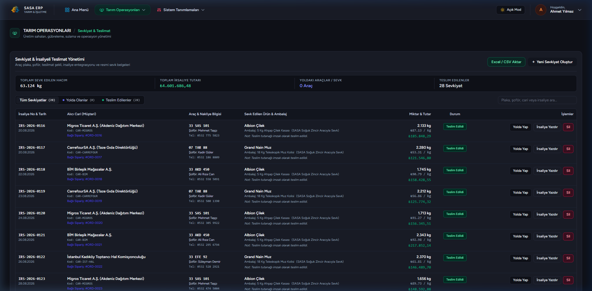

---

### 9. 👥 Günlük İşçi Formu & Çavuş Hasat Puantajı
Her gün sahaya gelen taşeron işçilerin puantajı, toplanan mahsul tartımları ve yönetici onay mekanizması.

- **Çavuş Hakediş Algoritması:** Gelen işçi sayısı, servis araç sayısı, yemek bedeli, çavuş katsayısı ve fazla mesaiye göre net hakediş hesaplama.
- **Hasat Kalemleri:** Ürün, kalite sınıfı (*1. Kalite, 2. Kalite, Sanayi*), kasa sayısı ve net kg kaydı.
- **Muz Çift Tartım Modülü:** Hal ve tüccar kantarı 1. ve 2. kalite fire tartım farkı takibi.
- **Yönetici Onayı:** Formların işletme yöneticisi tarafından incelenip tek tıkla onaylanması veya gerekçeli reddi.

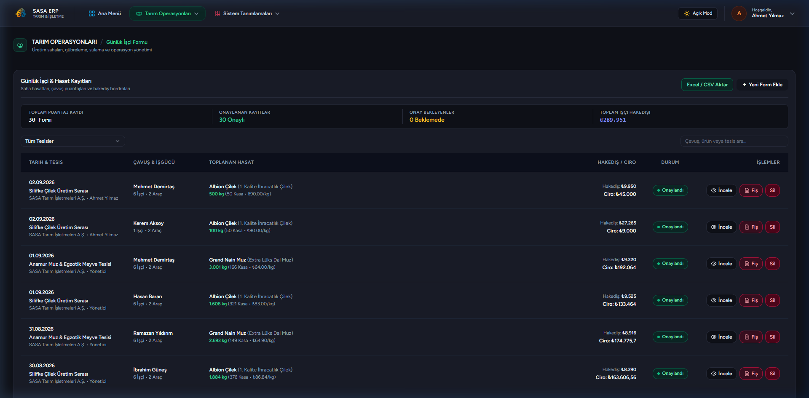

---

### 10. 👷 İşçi & Çavuş (Taşeron) Yönetimi
Sahada çalışan kayıtlı tarım işçileri ve taşeron çavuşların veri tabanı.

- **Kümülatif Hakediş Tablosu:** Çavuş bazında sezonluk toplam çalışılan gün, getirilen işçi sayısı, toplam araç ve kümülatif hakediş ödemeleri.
- **Performans Derecelendirmesi:** İşçi bazında performans puanı (1-5 yıldız) ve T.C. kimlik takibi.

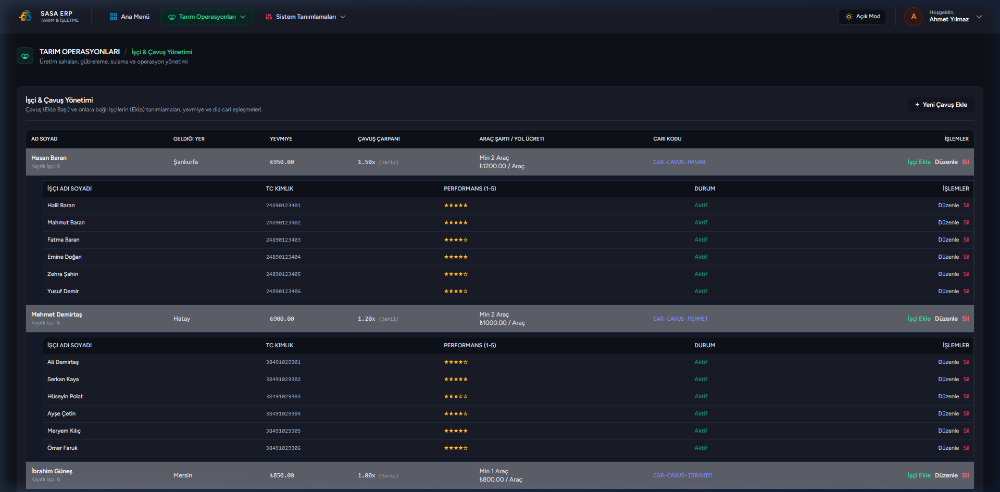

---

### 11. 📈 Stok İnceleme & Fire/Verim Analizi
Hasat edilen toplam ürünler ile sevk edilen ürünler arasındaki net depolama ve kalan ürün stok raporu.

- **Ürün ve Alt Tip Kırılımı:** Toplam hasat kg, paket/kasa sayısı, sevk edilen kg ve depoda kalan net stok kg.
- **Fire Oranı Hesaplama:** Hasat ile sevkiyat arasındaki verim ve fire yüzdesi analizi.

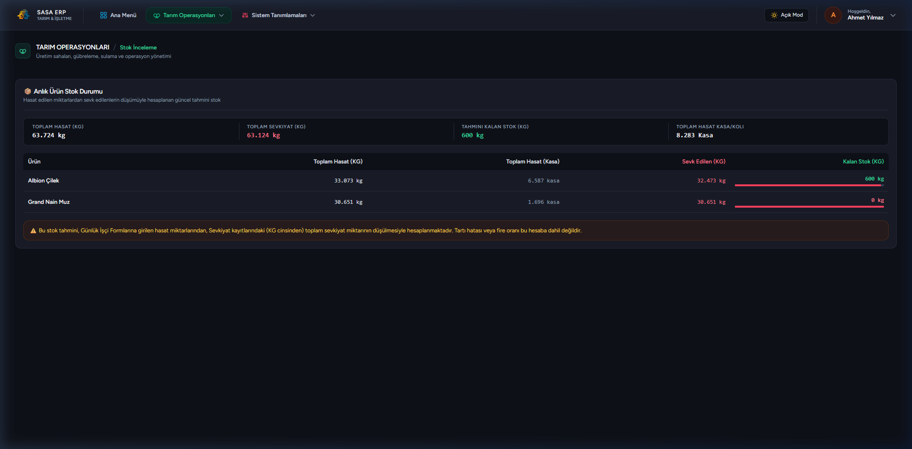

---

### 12. 🏢 Sistem Tanımlamaları - Firma & Tesisler
Holding veya işletmeye bağlı şirketlerin ve üretim sahalarının (seralar, tüneller, açık tarlalar) yönetimi.

- **DİA Senkronizasyonu:** DİA ERP'deki şirket kodları ve cari kartları ile anlık çift yönlü senkronizasyon.
- **Vana Tanımları:** Her üretim yerine ait sulama vanaları ve debi kapasiteleri.

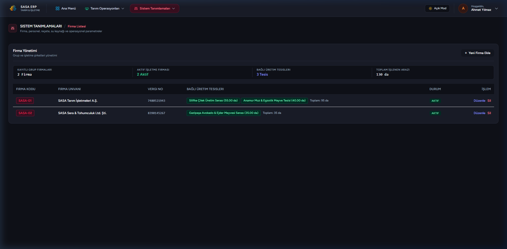

---

### 13. 🍓 Sistem Tanımlamaları - Ürünler & Kalite Sınıfları
Üretilen tarımsal mahsuller, girdi maddeleri, kalite alt tipleri ve paketleme ambalajları.

- **Kalite Kırılımları:** Örn. *Albion Çilek -> 1. Kalite İhracatlık, 2. Kalite İç Piyasa, Sanayi / Reçellik*.
- **Bağlı Ambalajlar:** 500gr şeffaf kap, 5 Kg ahşap kasa, 18 Kg teleskopik muz kolisi vb.

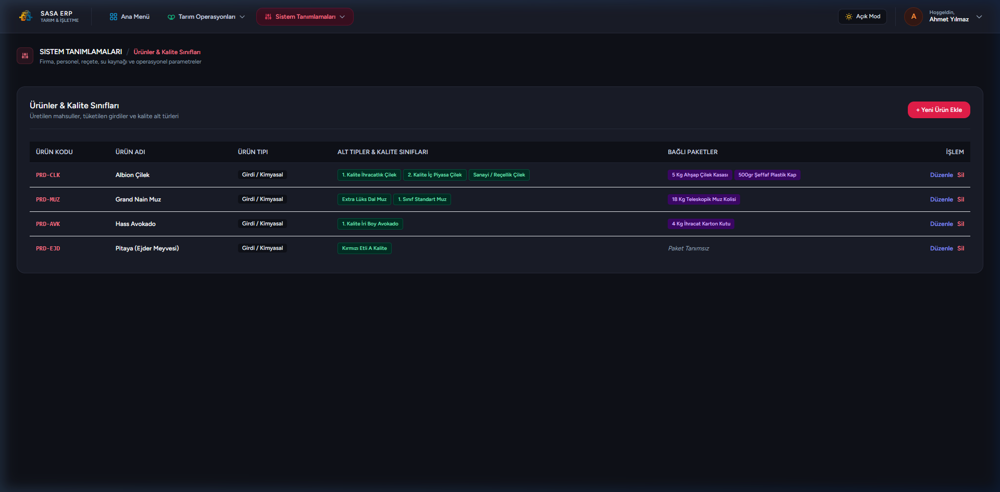

---

### 14. 🧪 Sistem Tanımlamaları - Reçeteler & Altyapı
Gübreleme ve zirai ilaçlama için standart kimyasal formüller ve su kuyuları.

- **A/B Tankı Kimyasal Formülleri:** Kalsiyum nitrat, potasyum nitrat, magnezyum sülfat vb. gübre bileşenleri ve gramajları.
- **Su Kaynakları:** Kuyu, gölet ve şebeke suyu analiz referansları.

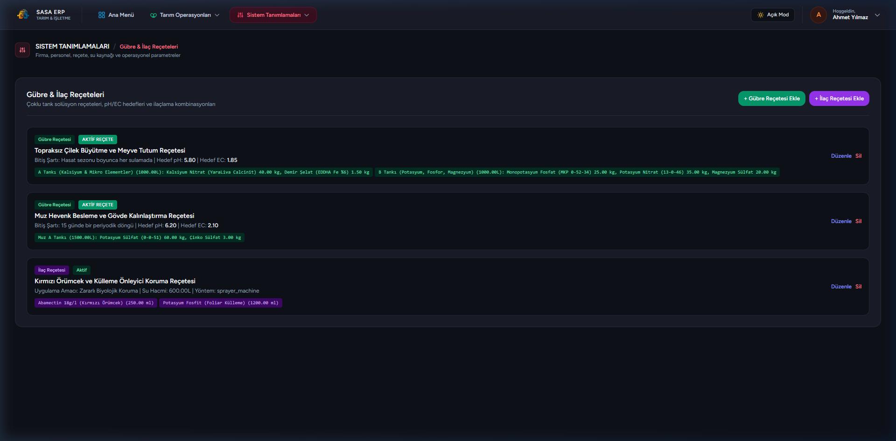

---

## 🛠️ Teknoloji Yığını (Tech Stack)

| Katman | Teknoloji | Açıklama |
|---|---|---|
| **Backend** | Laravel 11 / PHP 8.2+ | RESTful mimari, Eloquent ORM, Güçlü Doğrulama & Yetkilendirme |
| **Frontend** | Vue 3 (Composition API) | TypeScript tabanlı reaktif bileşen mimarisi |
| **Bağlantı Katmanı** | Inertia.js | API katmanına gerek duymadan Monolithic SPA deneyimi |
| **Stil & Tasarım** | Tailwind CSS 3.x | Modern UI, Dark/Light Mode, Cam Efektleri, Responsive Grid |
| **Derleme Aracı** | Vite | Ultra hızlı HMR (Hot Module Replacement) ve optimize bundle |
| **Veritabanı** | MySQL / PostgreSQL / SQLite | İlişkisel veri yapısı, Foreign Key kısıtlamaları ve index optimizasyonu |
| **Harici Entegrasyon** | DİA ERP Web Servisleri | Cari hesap ve kurumsal şirket senkronizasyonu |

---

## 💻 Kurulum & Çalıştırma

### Gereksinimler
- **PHP** >= 8.2 (Eklentiler: `pdo_mysql`, `mbstring`, `fileinfo`, `gd`, `curl`)
- **Composer**
- **Node.js** (>= 18.x) & **NPM**
- **MySQL** / MariaDB (veya SQLite)

### Adım Adım Kurulum

1. **Depoyu Klonlayın:**
   ```bash
   git clone https://github.com/Leansxd/sasa-tar-m-erp.git
   cd sasa-tar-m-erp
   ```

2. **PHP Bağımlılıklarını Yükleyin:**
   ```bash
   composer install
   ```

3. **Node.js Bağımlılıklarını Yükleyin:**
   ```bash
   npm install
   ```

4. **Ortam Dosyasını Hazırlayın:**
   ```bash
   # Linux / macOS:
   cp .env.example .env

   # Windows (PowerShell / CMD):
   copy .env.example .env

   php artisan key:generate
   ```

5. **Veritabanı Ayarlarını Yapın (`.env`):**

   *Seçenek A: MySQL (Önerilen)*
   ```env
   DB_CONNECTION=mysql
   DB_HOST=127.0.0.1
   DB_PORT=3306
   DB_DATABASE=sasa_tarim_erp
   DB_USERNAME=root
   DB_PASSWORD=
   ```
   *(MySQL'de `sasa_tarim_erp` adında boş bir veritabanı oluşturduğunuzdan emin olun.)*

   *Seçenek B: SQLite (Hızlı Test İçin)*
   ```env
   DB_CONNECTION=sqlite
   ```
   *(SQLite kullanacaksanız terminalde `touch database/database.sqlite` veya Windows'ta `New-Item database/database.sqlite` çalıştırın.)*

6. **Veritabanı Tablolarını ve Başlangıç Verilerini Oluşturun:**
   ```bash
   php artisan migrate --seed
   ```

7. **Storage Sembolik Linkini Oluşturun (Kantar ve Saha Fotoğrafları İçin):**
   ```bash
   php artisan storage:link
   ```

8. **Arayüzü Derleyin veya Geliştirici Modunda Başlatın:**
   ```bash
   # Geliştirici modu (anlık güncelleme için):
   npm run dev

   # Veya üretim derlemesi:
   npm run build
   ```

9. **Uygulama Sunucusunu Başlatın:**
   ```bash
   php artisan serve
   ```

Uygulama varsayılan olarak `http://127.0.0.1:8000` adresinde çalışacaktır.

---

### 🔧 Sık Karşılaşılan Sorunlar ve Çözümleri

- **Fotoğraflar Görünmüyor:** `php artisan storage:link` komutunu çalıştırdığınızdan ve `public/storage` kısayolunun oluştuğundan emin olun.
- **Önbellek Sorunları:** Yapılandırma veya rota değişikliklerinde:
  ```bash
  php artisan optimize:clear
  ```
- **Vite Port Çakışması:** 5173 portu doluysa `npm run build` ile doğrudan derleyip sadece `php artisan serve` kullanabilirsiniz.

---

### 🔑 Varsayılan Giriş Bilgileri

Veritabanı seeder'ı çalıştırıldığında aşağıdaki test hesapları hazır olarak oluşturulur:

| Rol | E-Posta | Şifre | Yetki Kapsamı |
|---|---|---|---|
| **Yönetici (Admin)** | `admin@sasa.com` | `password` | Tam yetki, onaylama ve sistem tanımlamaları |
| **Ziraat Mühendisi** | `ziraat.selin@sasa.com` | `password` | Tesis, Üretim ve Teknik modülleri |
| **Saha Sorumlusu** | `saha.mustafa@sasa.com` | `password` | Operasyon ve Günlük İşçi Puantajı |

---

### 🧪 Testlerin Çalıştırılması

Tüm backend birim ve entegrasyon testlerini çalıştırmak için:
```bash
php artisan test
```

---

## 🔒 Güvenlik & Yetkilendirme

Sistemde rol ve yetki tabanlı erişim kontrolü mevcuttur:
- **Yönetici (Admin):** Tüm modüllere, onay mekanizmalarına ve sistem tanımlamalarına tam erişim.
- **Saha Mühendisi / Sorumlu:** Yetkili olduğu departmanlara (*Tesis, Üretim, Teknik, Operasyon, Raporlar*) özel dinamik navigasyon erişimi.

---

## 📄 Lisans

Bu proje **SASA Tarım & İşletme** bünyesinde özel kullanım amacıyla geliştirilmiştir. Tüm hakları saklıdır.
